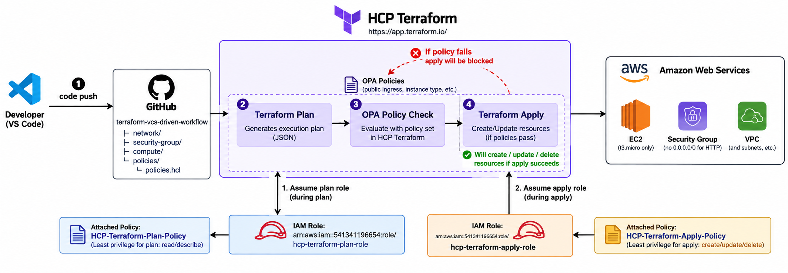
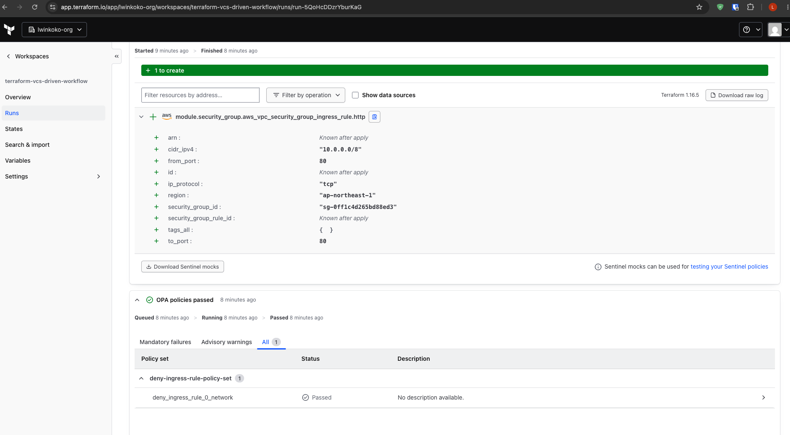
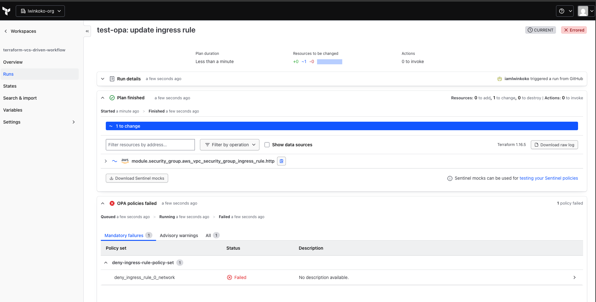

# Terraform VCS-Driven Workflow

A secure VCS-driven Infrastructure as Code (IaC) project using **Terraform, GitHub, HCP Terraform, AWS, OIDC, and Open Policy Agent (OPA)**.

This project demonstrates how infrastructure changes can be managed through Git, planned and applied remotely by HCP Terraform, authenticated to AWS without long-lived access keys, and validated by mandatory OPA policies before deployment.

---

## Architecture



### Workflow

```text
Developer / VS Code
        |
        | git commit & push
        v
GitHub Repository
        |
        | VCS trigger
        v
HCP Terraform
        |
        +---- Terraform Plan
        |
        +---- OPA Policy Check
        |          |
        |          +---- PASS ----> Terraform Apply
        |          |
        |          +---- FAIL ----> Apply Blocked
        |
        v
AWS
├── VPC
├── Subnet
├── Internet Gateway
├── Route Table
├── Security Group
└── EC2
```

The workflow follows these steps:

1. Terraform code is developed locally using VS Code.
2. Changes are committed and pushed to GitHub.
3. GitHub triggers an HCP Terraform run through the VCS integration.
4. HCP Terraform assumes the AWS **Plan IAM Role** using OIDC.
5. Terraform generates an execution plan.
6. OPA evaluates the Terraform plan against mandatory security policies.
7. If an OPA policy fails, Terraform Apply is blocked.
8. If all mandatory policies pass, Terraform can proceed to Apply.
9. HCP Terraform assumes the AWS **Apply IAM Role**.
10. Terraform creates, updates, or deletes AWS infrastructure.

---

## Project Structure

```text
terraform-vcs-driven-workflow/
├── docs/
│   └── images/
│       ├── terraform-vcs-workflow.png
│       ├── opa-pass.png
│       └── opa-fail.png
│
├── modules/
│   ├── compute/
│   │   ├── main.tf
│   │   ├── outputs.tf
│   │   └── variables.tf
│   │
│   ├── network/
│   │   ├── main.tf
│   │   ├── outputs.tf
│   │   └── variables.tf
│   │
│   └── security-group/
│       ├── main.tf
│       ├── outputs.tf
│       └── variables.tf
│
├── policies/
├── .gitignore
├── .terraform.lock.hcl
├── main.tf
├── providers.tf
├── terraform.tfvars
├── variables.tf
└── README.md
```

The Terraform configuration is separated into reusable modules for networking, security groups, and compute resources.

---

## Technologies

| Technology | Purpose |
|---|---|
| Terraform | Infrastructure as Code |
| HCP Terraform | Remote plan, apply, state, and policy enforcement |
| GitHub | Version control and VCS workflow |
| AWS | Cloud infrastructure |
| AWS IAM | Least-privilege access control |
| OIDC | Dynamic AWS authentication |
| Open Policy Agent | Policy as Code |
| Rego | OPA policy language |

---

## Terraform Modules

### Network

The `network` module manages the AWS networking infrastructure.

Resources include:

- VPC
- Public subnet
- Internet Gateway
- Route table
- Route table association

Example network configuration:

```hcl
vpc_cidr           = "10.0.0.0/16"
public_subnet_cidr = "10.0.1.0/24"
availability_zone  = "ap-northeast-1a"
```

### Security Group

The `security-group` module manages EC2 network access.

The HTTP ingress CIDR is provided through:

```hcl
allowed_http_cidr_block = "10.0.0.0/8"
```

The OPA policy prevents public HTTP ingress from:

```text
0.0.0.0/0
```

### Compute

The `compute` module manages the EC2 instance.

The project uses:

```hcl
instance_type = "t3.micro"
```

The Amazon Linux 2023 AMI is dynamically discovered using an AWS AMI data source instead of hardcoding an AMI ID.

---

## HCP Terraform

The Terraform workspace is connected directly to the GitHub repository.

### Workspace

```text
terraform-vcs-driven-workflow
```

### Execution Mode

```text
Remote
```

Changes pushed to the configured Git branch automatically trigger an HCP Terraform run.

```text
git push
   |
   v
GitHub
   |
   v
HCP Terraform
   |
   +--> Plan
   |
   +--> OPA
   |
   +--> Apply
   |
   v
AWS
```

Terraform state is maintained remotely by HCP Terraform.

---

## AWS Authentication with OIDC

This project does **not** use long-lived AWS access keys.

HCP Terraform authenticates to AWS using **dynamic provider credentials through OIDC**.

Two separate IAM roles are used:

```text
HCP Terraform
      |
      +------ PLAN ------> hcp-terraform-plan-role
      |
      └------ APPLY -----> hcp-terraform-apply-role
```

### Plan Role

```text
arn:aws:iam::541341196654:role/hcp-terraform-plan-role
```

Attached policy:

```text
HCP-Terraform-Plan-Policy
```

Purpose:

- Used during Terraform Plan
- Read/Describe AWS resources
- Allows Terraform to determine infrastructure changes
- Does not provide general infrastructure modification permissions

### Apply Role

```text
arn:aws:iam::541341196654:role/hcp-terraform-apply-role
```

Attached policy:

```text
HCP-Terraform-Apply-Policy
```

Purpose:

- Used during Terraform Apply
- Create resources
- Update resources
- Delete resources
- Read resources required during Apply

This separation follows the principle of least privilege.

---

## HCP Terraform Environment Variables

The workspace uses the following environment variables:

```text
TFC_AWS_PROVIDER_AUTH=true

TFC_AWS_PLAN_ROLE_ARN=arn:aws:iam::541341196654:role/hcp-terraform-plan-role

TFC_AWS_APPLY_ROLE_ARN=arn:aws:iam::541341196654:role/hcp-terraform-apply-role
```

No `AWS_ACCESS_KEY_ID` or `AWS_SECRET_ACCESS_KEY` is required.

---

## OIDC Authentication Flow

```text
HCP Terraform
      |
      | OIDC token
      v
AWS IAM OIDC Provider
      |
      +--------------------------+
      |                          |
      v                          v
Plan Role                    Apply Role
      |                          |
      v                          v
Plan Policy                  Apply Policy
      |                          |
Read / Describe          Create / Update / Delete
```

The IAM role trust policies restrict access to the expected HCP Terraform organization, project, workspace, and run phase.

---

# OPA Policy Enforcement

Open Policy Agent is used as a security gate between **Terraform Plan** and **Terraform Apply**.

```text
Terraform Plan
      |
      v
OPA Policy Check
      |
      +------ PASS ------> Terraform Apply
      |
      └------ FAIL ------> Apply Blocked
```

The OPA policy is configured as a **Mandatory** policy in HCP Terraform.

Therefore, a failed policy prevents infrastructure changes from being applied.

---

## Policy: Block Public HTTP Ingress

The security policy prevents security group ingress rules from allowing:

```text
0.0.0.0/0
```

The policy evaluates planned resources of type:

```text
aws_vpc_security_group_ingress_rule
```

and checks:

```rego
resource.change.after.cidr_ipv4 == "0.0.0.0/0"
```

Example policy:

```rego
package terraform.security.public_ingress

import input.plan as plan

deny := [msg |
    resource := plan.resource_changes[_]

    resource.type == "aws_vpc_security_group_ingress_rule"
    resource.change.after.cidr_ipv4 == "0.0.0.0/0"

    msg := sprintf(
        "%s allows inbound traffic from 0.0.0.0/0. Public ingress is not allowed.",
        [resource.address]
    )
]
```

HCP Terraform query:

```text
data.terraform.security.public_ingress.deny
```

---

# OPA Policy Test Results

The mandatory OPA policy was tested with both an allowed CIDR and a prohibited public CIDR.

## Test 1 — Private HTTP Ingress

Terraform configuration:

```hcl
allowed_http_cidr_block = "10.0.0.0/8"
```

Terraform planned the security group ingress rule with:

```text
cidr_ipv4   = "10.0.0.0/8"
from_port   = 80
to_port     = 80
ip_protocol = "tcp"
```

### Result

> **OPA Policy: PASSED ✅**



Because `10.0.0.0/8` does not violate the public-ingress policy, HCP Terraform allows the run to continue.

```text
10.0.0.0/8
     |
     v
Terraform Plan
     |
     v
OPA Policy
     |
     v
PASS
     |
     v
Apply Allowed
```

---

## Test 2 — Public HTTP Ingress

The configuration was then changed to:

```hcl
allowed_http_cidr_block = "0.0.0.0/0"
```

Terraform successfully generated the execution plan.

However, the OPA policy detected the prohibited public ingress rule.

### Result

> **OPA Policy: FAILED ❌**



Because the policy is configured as **Mandatory**, HCP Terraform stopped the run before Apply.

```text
0.0.0.0/0
     |
     v
Terraform Plan
     |
     v
OPA Policy
     |
     v
FAIL
     |
     X
Terraform Apply
BLOCKED
```

This demonstrates that infrastructure can successfully pass Terraform validation and planning while still being prevented from deployment by an organizational security policy.

---

## EC2 Instance Type Guardrail

The project also targets the following EC2 instance type:

```text
t3.micro
```

An additional OPA guardrail can enforce:

```text
aws_instance.instance_type == "t3.micro"
```

Any planned EC2 instance using another instance type can therefore be rejected before Terraform Apply.

---

## Terraform Provider

The AWS provider is configured in the root module:

```hcl
terraform {
  required_providers {
    aws = {
      source  = "hashicorp/aws"
      version = "6.67.0"
    }
  }
}

provider "aws" {
  region = var.aws_region
}
```

No static AWS credentials are configured in the provider.

---

## Example Configuration

Example `terraform.tfvars`:

```hcl
project_name      = "terraform-vcs"
aws_region        = "ap-northeast-1"
availability_zone = "ap-northeast-1a"

vpc_cidr           = "10.0.0.0/16"
public_subnet_cidr = "10.0.1.0/24"

instance_type = "t3.micro"

ssh_cidr_block          = null
allowed_http_cidr_block = "10.0.0.0/8"
```

---

## VCS Workflow

Changes are deployed through Git instead of manually running production applies from a developer machine.

```bash
git add .
git commit -m "update infrastructure"
git push
```

The push triggers the HCP Terraform workflow:

```text
Commit
   |
   v
GitHub
   |
   v
Terraform Plan
   |
   v
OPA Policy Check
   |
   +---- Failed ----> STOP
   |
   └---- Passed
          |
          v
     Terraform Apply
          |
          v
         AWS
```

---

## Destroying Infrastructure

Infrastructure should be destroyed through the HCP Terraform workspace so that the operation uses the same remote Terraform state and AWS dynamic credentials.

The destroy workflow is:

```text
HCP Terraform
      |
      v
Destroy Plan
      |
      v
Policy / Run Checks
      |
      v
AWS Apply Role
      |
      v
Destroy Managed AWS Resources
```

Always review the destroy plan before confirming the operation.

Destroying the infrastructure does not require deleting the HCP Terraform workspace.

---

## Security Practices

This project demonstrates several Terraform and cloud security practices:

- Infrastructure as Code
- Git-based change management
- Remote Terraform execution
- Remote Terraform state
- No long-lived AWS access keys
- OIDC workload identity
- Separate Plan and Apply IAM roles
- Least-privilege IAM policies
- Mandatory Policy as Code enforcement
- Public ingress protection
- EC2 instance-type restrictions
- Modular Terraform configuration

---

## Key Security Controls

| Control | Implementation |
|---|---|
| AWS authentication | OIDC dynamic credentials |
| Plan permissions | `hcp-terraform-plan-role` |
| Apply permissions | `hcp-terraform-apply-role` |
| Public ingress | Blocked by OPA |
| EC2 instance type | Restricted to `t3.micro` |
| Terraform state | HCP Terraform remote state |
| Infrastructure changes | Git/VCS driven |
| Policy enforcement | Mandatory OPA policy |

---

## Summary

This project demonstrates a secure Terraform VCS-driven deployment workflow:

```text
Code
  ↓
GitHub
  ↓
HCP Terraform
  ↓
Terraform Plan
  ↓
OPA Security Policy
  ↓
Terraform Apply
  ↓
AWS
```

The main security principle is:

> **A valid Terraform configuration is not automatically an approved infrastructure change.**

Terraform determines **what will change**, while OPA determines **whether that change is allowed**.

Only infrastructure changes that satisfy the defined security policies are allowed to reach AWS.